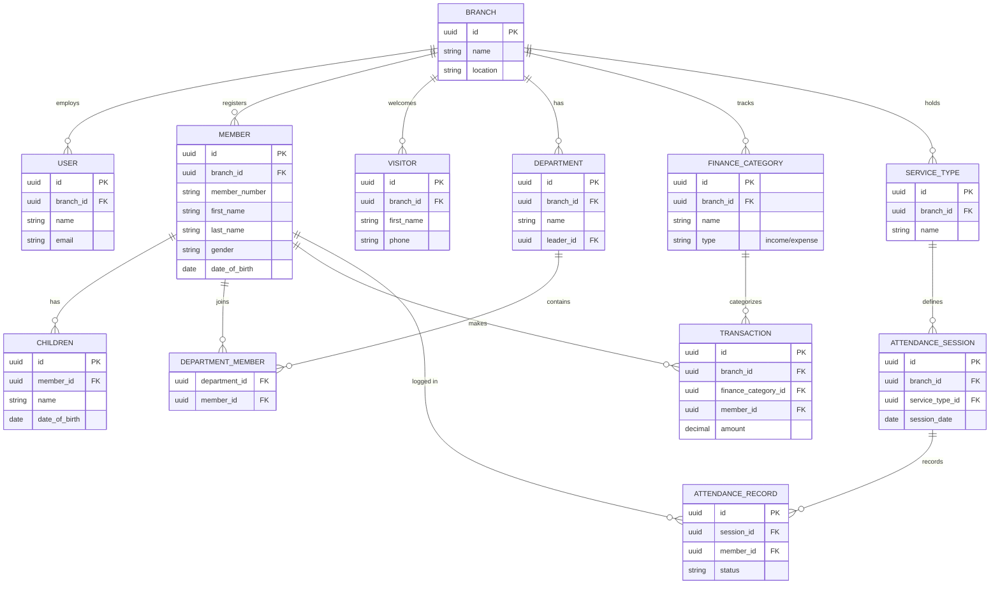

# Database Structure

WIS-CMS relies on PostgreSQL 16. The schema is highly normalized and utilizes **UUID primary keys** for enhanced security (preventing ID enumeration) and better support for distributed databases in the future.

## Entity Relationship Diagram

## Table Deep Dive

### Core Entities
- **branches**: The absolute foundation of the multi-tenancy. Every subsequent record points back here via `branch_id`.
- **users**: System administrators and staff. Linked to a branch and assigned roles via Spatie's polymorphic tables.
- **members**: The largest and most complex dataset. Tracks detailed demographic data, contact info, and marital status. Features Laravel's `SoftDeletes` to preserve historical integrity if a member leaves.
- **visitors**: Similar to members but lightweight. The system supports a conversion mechanism to transition a visitor to a full member.
- **children**: Built with a one-to-many relationship with members to track family units for the children's ministry.

### Organizational Groupings
- **departments**: e.g., Choir, Ushers, Media. Includes a `leader_id` pointing to a user or member.
- **department_members**: A pivot table establishing a robust many-to-many relationship between departments and members.

### Operational Data (Planned / In-Progress)
- **finance_categories & transactions**: Facilitates double-entry-like bookkeeping for church finances, categorizing things like Tithes, Welfare, and Offertory into discrete transactions.
- **service_types, attendance_sessions, attendance_records**: A highly structured hierarchical schema to accurately track exactly who attended which specific service (e.g., Sunday Service vs. Friday Night Prayer) on a given date.
- **messages & message_recipients**: The underlying architecture designed to eventually support mass SMS and Email broadcasts.
