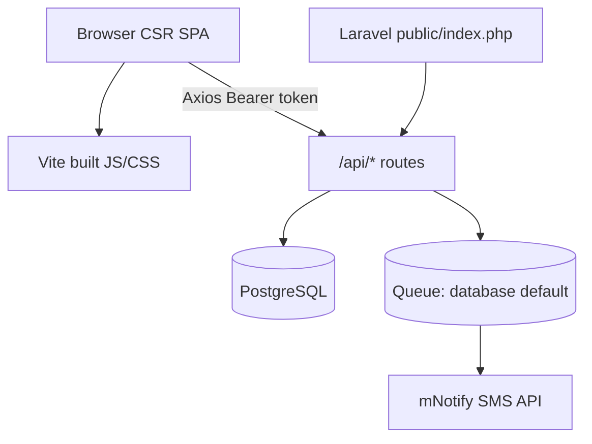

# Architecture & Performance Posture

## Stack

| Layer | Technology |
|-------|------------|
| Backend | PHP 8.3+, Laravel 13 |
| Frontend | React 19, React Router 7, Vite 8, Tailwind CSS v4 |
| Database | PostgreSQL 16 (SQLite for local trials) |
| Auth | Laravel Sanctum (Bearer tokens) |
| RBAC | spatie/laravel-permission |
| PDF / exports | DomPDF, OpenSpout |
| SMS | mNotify (`MnotifySmsService`) |

Application root: repository root (parent of `performance-analysis/`)

## Request flow

### Typical authenticated request

1. Browser loads empty shell from `welcome.blade.php` + **~956 KB JS bundle**.
2. React bootstraps; `AuthContext` reads token from `localStorage`.
3. API call hits `routes/api.php` → `auth:sanctum` → `EnsurePasswordChanged` → optional `permission:*` middleware.
4. Controller queries PostgreSQL via Eloquent; returns JSON.
5. Mutations may dispatch jobs (SMS/email) or run inline (PDF, activity log).

## Entry points

| Type | Path |
|------|------|
| HTTP front controller | `public/index.php` |
| API routes | `routes/api.php` |
| Web (SPA catch-all) | `routes/web.php` |
| Scheduler | `routes/console.php` |
| React entry | `resources/js/main.jsx` → `AppRouter.jsx` |
| Jobs | `app/Jobs/SendBroadcastMessageJob.php`, `DispatchAttendanceFollowUpJob.php` |

## What is optimized today

| Area | Mechanism |
|------|-----------|
| List APIs | `paginate(15–20)` on most indexes |
| Relations | Widespread `->with([...])` on controllers |
| Exports | `query->lazy()->each()` — memory-safe streaming |
| Permissions | Spatie registry cache 24h (`config/permission.php`) |
| Member numbers | `lockForUpdate()` in transaction on create |
| Follow-up cron | Composite index `(follow_up_status, created_at)` |
| Messaging design | `ShouldQueue` jobs when queue ≠ sync |

## What is not optimized

| Area | Gap |
|------|-----|
| Frontend delivery | Single bundle, no `React.lazy`, no `manualChunks` |
| Rendering | CSR only — no SSR/SSG or data prefetch |
| HTTP caching | No `Cache-Control` / ETag on JSON APIs |
| App-level cache | No `Cache::remember` for dashboard/stats |
| Default infra | `CACHE_STORE=database`, `QUEUE_CONNECTION=database` in `.env.example` |
| Production build | No CDN, no Vite chunk strategy beyond defaults |
| Advanced Laravel | No Octane, Horizon, or Pulse |

## Vite configuration

[`vite.config.js`](../vite.config.js):

- Single input: `resources/js/main.jsx` + `resources/css/app.css`
- No `build.rollupOptions.output.manualChunks`
- Dev server: `127.0.0.1:3000`

Production build produces **one JS chunk** (~956 KB). Vite warns chunks exceed 500 KB.

## Deployment expectations

[`DEPLOYMENT.md`](../DEPLOYMENT.md) documents:

- `composer install --no-dev --optimize-autoloader`
- `php artisan config:cache`, `route:cache`, `view:cache`
- Supervisor for `queue:work`
- Cron for `schedule:run`
- Redis recommended for cache/queue in production (not defaulted in `.env.example`)

These are **operational** optimizations—not enforced in application code.

## Data model scale assumptions

The CMS is designed for a **single branch** (or few branches) with:

- Hundreds to low thousands of members
- Regular Sunday services + department/cell meetings
- Broadcast SMS/email to filtered member sets

Hot paths that break this assumption first: branch-wide adult attendance, message broadcast, admin dashboard on login.
